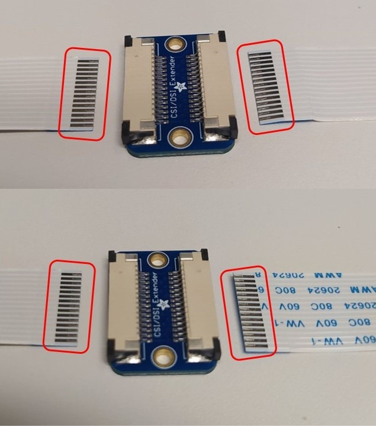

# Public installation and usage documentation for BAUTA's Blindsensorkit

## Setting up the hardware

The Blindsensorkit comes with three components. The first one is the optical part with the lens
encased in a waterproof case, the second one is BAUTA's security module also encased, and the 
third is an extension adapter to allow to flexible extend the ribbon cable that usually is 
connected directly between the optical part and BAUTA's security module. This extension adapter
also is enclosed in a simple removable case to protect it from potential electrostatic discharges
during operation and installation.

After mounting both the optical and security module and before connecting the power-supply to 
the security module make sure you connect the two ribbon cables from each first to the 
extension adapter. For doing this you first have to open up the enclosure of the adapter which 
should look like the following:

<p align="center"></p>

After the enclosure has been opened you have to take the adapter out of the enclosure to be able
to connect the two ribbon cables on each end

<p align="center"></p>

Please ensure you place the adapter with the correct side up just as shown in the picture above
and also the ribbon cables are facing the same way up as in the picture with the silver connector
being clearly visible. Connecting the cables the wrong way can lead potentially to a short circuit and
render the device unusuable, so please be careful!

After you have connected the two ribbon cables to the adapter you can place it back inside its
enclosure as show below

<p align="center"></p>

and close the lid on top again

Now before connecting the power supply to BAUTA's security module there is just one final step 
missing it can be helpful but is not mandatory for the operation of the device to connect the 
provided Cat5e network cable to plug into the security module and the other end into your local 
network infrastructure (hub, switch, etc.). The security module is configured to use automatic 
address assignment (via DHCP) and as long as your network 
infrastructure does not have MAC blocking active it should automatically receive a new IP address
after switching on. In case your network infrastructure does have MAC listing active you have to 
ask your network administrator to add the device's MAC address to the whitelist. The MAC address 
can be found on the back of the security module.

### Start-up sequence

After receiving power it takes about 90 seconds for the device to be fully operational and
it is starting recording.

### Quick verification if all is running

Before being able to do this you have to ask your network administrator which IP address in your
network the device has been assigned to. With the help of the MAC address that is written on the
back of the security module it should be possible to look it up. Once you have obtained the
IP address and the power to the security module has been connected at least for 90 seconds, you 
can simply open a web browser on a device that is the same network

```
http://IP_ADDRESS_OF_SECURITY_MODULE:8080/getsnapshot
```
You can also use this snapshot functionality to visually allign the area you are interesteed in to observer

### Additional configuration options

The default recording time per session is currently 5 hours you can change the recording length per session
by using a web browser that is in the same network as the security module by entering this address:

```
http://IP_ADDRESS_OF_SECURITY_MODULE:8080/setsessiondur?duration=TIMEINHOURSINCLUDINGFRACTIONALHRS
```

for example if you want 6.5 hours recording length you enter

```
http://IP_ADDRESS_OF_SECURITY_MODULE:8080/setsessiondur?duration=6.5
```

Please note the maximum recording length per session is 12 hours. You can also get the current
recording length by using this URL:

```
http://IP_ADDRESS_OF_SECURITY_MODULE:8080/getsessiondur
```

Additionally the sensor comes with three different exposure settings depending on the environment 
the sensor is placed the default exposure might be either too long or too short, to change to
a different exposure mode you can use:

```
http://IP_ADDRESS_OF_SECURITY_MODULE:8080/setexposure?expmode={0,1,2}
```
 
Finally you can get the current exposure mode via this URL:

```
http://IP_ADDRESS_OF_SECURITY_MODULE:8080/getexposure
```
